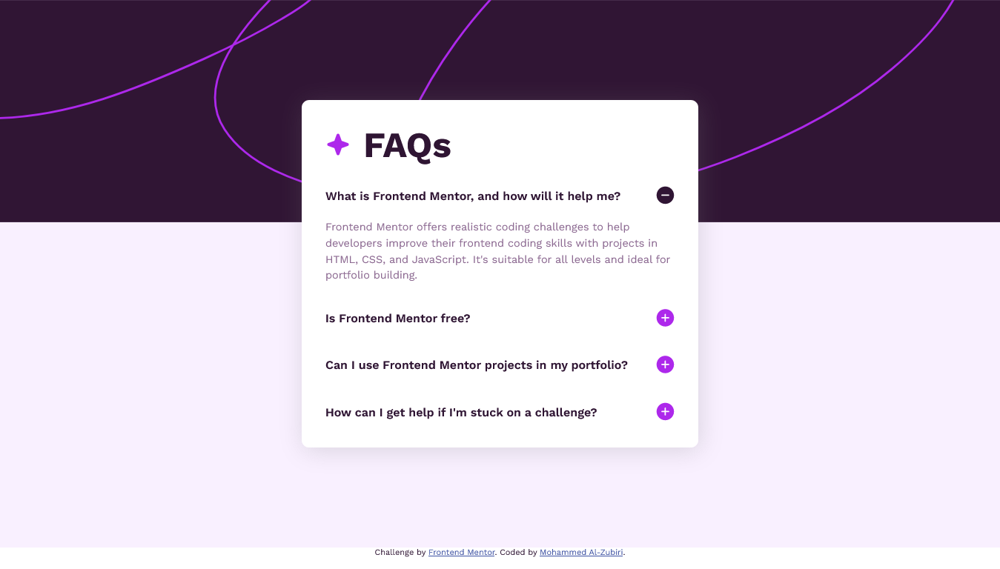

# Frontend Mentor - FAQ accordion solution

This is a solution to the [FAQ accordion challenge on Frontend Mentor](https://www.frontendmentor.io/challenges/faq-accordion-wyfFdeBwBz). Frontend Mentor challenges help you improve your coding skills by building realistic projects. 

## Table of contents

- [Overview](#overview)
  - [The challenge](#the-challenge)
  - [Screenshot](#screenshot)
  - [Links](#links)
- [My process](#my-process)
  - [Built with](#built-with)
  - [What I learned](#what-i-learned)
  - [Continued development](#continued-development)
  - [Useful resources](#useful-resources)
- [Author](#author)

## Overview

### The challenge

Users should be able to:

- Hide/Show the answer to a question when the question is clicked
- Navigate the questions and hide/show answers using keyboard navigation alone
- View the optimal layout for the interface depending on their device's screen size
- See hover and focus states for all interactive elements on the page

### Screenshot



### Links

- Solution URL: [Add solution URL here](https://github.com/Mohammed-Al-Zubiri/FAQ-Accordion)
- Live Site URL: [Add live site URL here](https://mohammed-al-zubiri.github.io/FAQ-Accordion/)

## My process

### Built with

- Semantic HTML5 markup
- CSS
- Desktop-first workflow
- ```<details>```: The Details disclosure element

### What I learned

One of the important things I learned when coding this challange is the ```<details>``` HTML5 element, which has bultin disclosure widget (accordion item like) behaviour (for all supported browsers) without the need for using JavaScript (propably, unless you need to impelement a complete transition animation).

```<details>``` is used alongside with the ```<summary>``` element as the title for the accordion item, so everything inside ```<details>``` (but the ```<summary>``` contents) is hidden unless ```open``` attribute is provided.
When the ```<summary>``` element is clicked, the ```open``` attribute is toggled (added/removed) for the ```<details>``` element, thus causing its content to show/hide.

Here is an example:

```html
<details>
  <summary>
    What is Frontend Mentor, and how will it help me?
  </summary>
  <p>
    Frontend Mentor offers realistic coding challenges to help developers improve their
    frontend coding skills with projects in HTML, CSS, and JavaScript. It's suitable for
    all levels and ideal for portfolio building.
  </p>
</details>
```

By default, the ```<summary>``` element will have a leading triangle icon as its ```list-style``` property, so you can remove it with ```list-style: none``` 
```css
summary {
  list-style: none;
}
```

The ```<details>``` and ```<summary>``` elements have accessibility quirks, so the user can navigate through the accordion items and show/hide their content using the keyboard.


### Useful resources

- [The ```details``` element](https://www.w3.org/TR/2011/WD-html5-author-20110809/the-details-element.html) - Know more about the ```details``` element.
- [Stackoverflow answer (open/close transition)](https://stackoverflow.com/a/73447722) - This is a clever solution for adding open/close transition to the ```details``` element (not fully transitioning but good enough for this one, since it is not required in [The challenge](#the-challenge))

## Author

- Github Profile - [@Mohammed-Al-Zubiri](https://github.com/Mohammed-Al-Zubiri)
- Frontend Mentor - [@Mohammed-Al-Zubiri](https://www.frontendmentor.io/profile/Mohammed-Al-Zubiri)